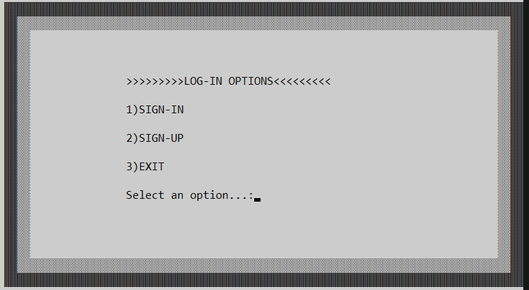
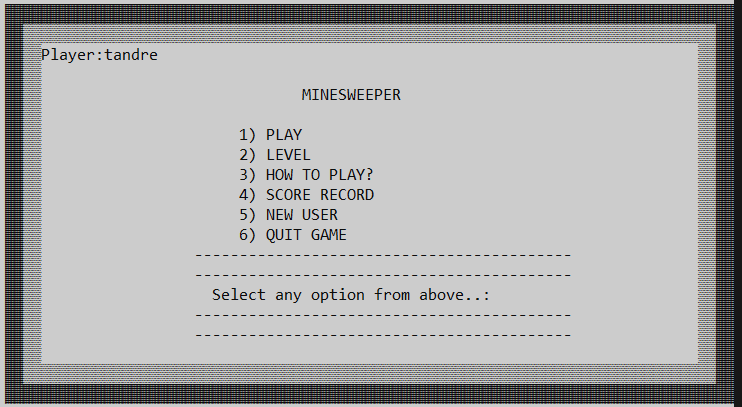
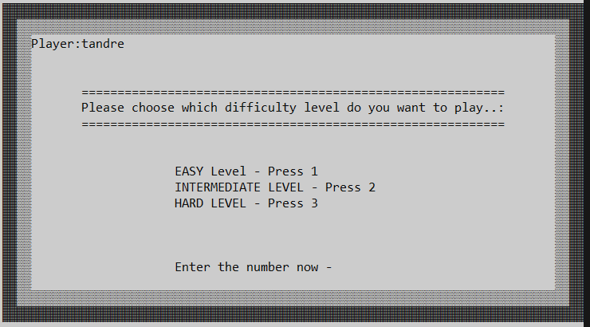
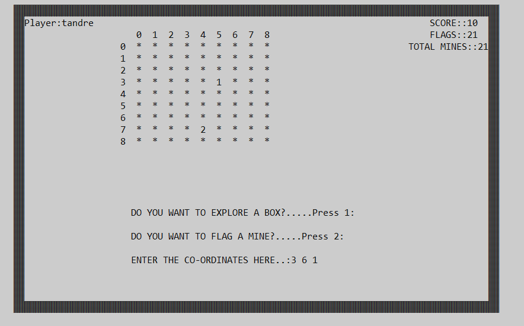
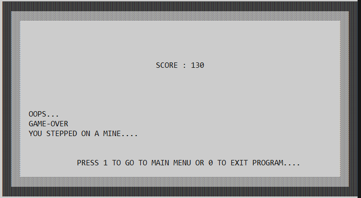

# Minesweeper Complete Edition

A terminal-based Minesweeper game written in C. The project implements classic Minesweeper gameplay with login/sign-up functionality, difficulty selection, random mine placement, cell opening, mine flagging, score tracking, and a menu-driven terminal interface.

This project was originally developed as a C programming project and later cleaned for use as part of a games programming placement portfolio.

## Project Overview

Minesweeper is a grid-based puzzle game where the player must avoid hidden mines. The player opens cells on the board and uses the numbers shown to work out where mines may be located.

This version runs in the Windows terminal and uses text-based input. The player enters coordinates and chooses whether to open a cell or flag a suspected mine.

## Features

* Terminal-based Minesweeper gameplay
* Login and sign-up system
* Menu-driven user interface
* Difficulty selection
* Random mine placement
* Cell opening and mine flagging
* Score tracking
* Win and loss condition handling
* File handling for user records and scores
* Windows console formatting using cursor positioning and screen clearing

## Development Environment

This project was developed and tested as a Windows console application.

* Language: C
* IDE: Code::Blocks
* Compiler: GNU GCC Compiler / MinGW
* Platform: Windows terminal / Command Prompt

## How to Build and Run

### Requirements

To build the project locally, you need:

* Code::Blocks with MinGW installed, or
* GCC/MinGW installed separately

### Compile with GCC/MinGW

From the project folder, run:

```bash
gcc src/minesweeper.c -o minesweeper.exe
```

### Run

On Windows:

```bash
minesweeper.exe
```

## Platform Note

This project uses Windows-specific console features such as `windows.h`, cursor positioning, screen clearing, colour changes, and `Sleep()`. Because of this, it is intended to run on Windows using GCC/MinGW or Code::Blocks with MinGW.

## How to Play

The player selects a difficulty level and plays on a square grid. Each move uses three numbers:

```text
row column action
```

The first number is the row.

The second number is the column.

The third number is the action.

Actions:

```text
1 = Open a cell
2 = Flag a suspected mine
```

Example:

```text
1 3 1
```

This means the player selected row `1`, column `3`, and chose to open the cell.

The player loses if they open a cell containing a mine. The player wins by correctly identifying the mine positions.

Full gameplay rules are available in [`docs/rules.md`](docs/rules.md).

## Project Structure

```text
minesweeper-complete-edition/
├── README.md
├── LICENSE
├── .gitignore
├── docs/
│   ├── rules.md
│   └── screenshots/
└── src/
    └── minesweeper.c
```

## Screenshots

### Login Menu



### Main Menu



### Difficulty Selection



### Gameplay



### Game Over



## C Programming Concepts Demonstrated

This project demonstrates several C programming concepts:

* 2D arrays for grid-based board representation
* Functions for separating game logic
* Loops for gameplay flow and board display
* Conditional statements for menu choices and game decisions
* Random number generation for mine placement
* File handling for user and score records
* String handling for login and sign-up functionality
* Input handling for player moves
* Boundary checking for grid coordinates
* Game state management using arrays and variables

## Project Maintenance Notes

The repository was cleaned and updated for portfolio presentation. The main updates include:

* Organised the source code into a `src/` folder
* Added clearer project documentation
* Added a separate rules document in `docs/rules.md`
* Added screenshot support through `docs/screenshots/`
* Removed compiled build files from the repository
* Excluded runtime user and score files from version control
* Added notes about the Windows/MinGW build environment
* Updated input handling in the login/sign-up section to avoid skipped username input

## Future Improvements

Possible future improvements include:

* Refactoring the program into multiple source files
* Improving input validation
* Replacing unsafe or outdated input functions
* Adding automated tests for board and mine logic
* Improving score record formatting
* Adding a timer
* Creating a graphical version using a game engine or graphics library

## License

This project is licensed under the MIT License.
